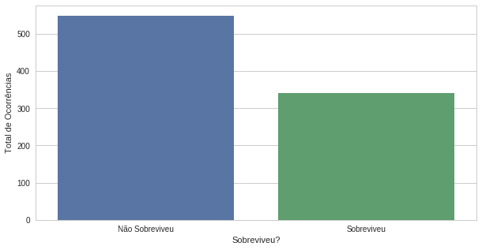
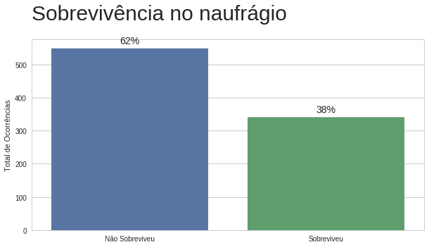
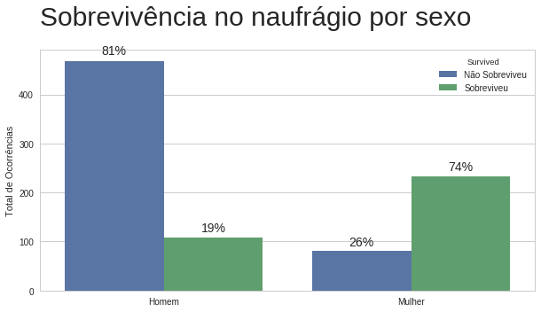
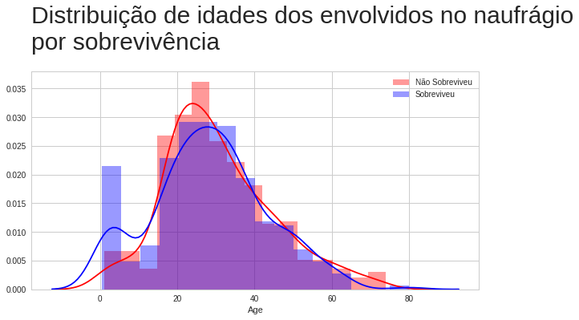
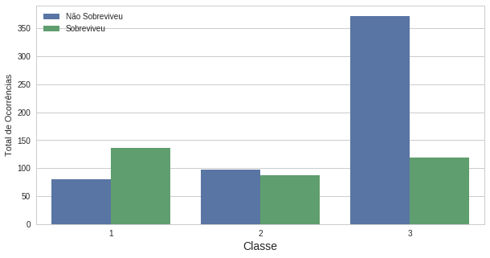
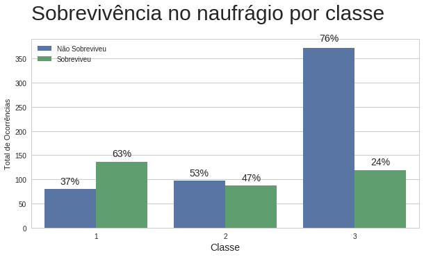
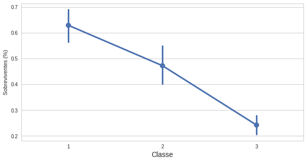

# Programa Nanodegree Fundamentos de Data Science II


### Marlesson R. O. de Santana

Public: https://nbviewer.jupyter.org/github/marlesson/Titanic-Data-Visualizer/blob/master/Data%20Visualization.ipynb

## Resumo


O naufrágio do RMS Titanic é um dos naufrágios mais famosos da história. Em 15 de abril de 1912, durante sua viagem inaugural, o Titanic afundou depois de colidir com um iceberg, matando 1502 de 2224 passageiros e tripulantes. 

Uma das razões pelas quais o naufrágio levou a uma grande perda de vidas era que não havia botes salva-vidas suficientes para os passageiros e tripulantes. Embora houvesse algum elemento de sorte envolvido na sobrevivência do naufrágio, alguns grupos de pessoas eram mais propensos a sobreviver do que outros, como mulheres, crianças e a classe alta. Vamos analisar o quanto esses fatores propiciaram para a sobrevivência do passageiro.


## Design

O designer utilizado para representar os dados foram os gráficos de Barra, Histogramas e gráficos de tendência.

Alguns elementos nos gráficos foram melhorando desde a primeira versão. Como exemplo, o gráfico de "Sobrevivência no naufráfio" em sua primeira versão não apresentava nem título nem a porcentagem, veja abaixo:




Na última versão do gráfico de "Sobrevivência no naufráfio" foram adicionaos os elementos para facilitar o entendimento.




Ao adicionar a porcentagem como número em cima das barras, facilitou o entendimento de porcentagem que antes era implícipo pelo tamanho da barra. Também foi retirada a legenda do eixo X, visto que já tem informações suficiêntes para compreender o contexto. Com relação ao título do gráfico, essa mudança foi em todos os gráficos, que na versão apresenta sempre o título.

Um outro exemplo das mesmas modificações, onde é perceptível a melhora no entendimento do gráfico, estão nos gráficos abaixo.

Antes:


Depois:




Um outro designer interessante é o de histograma, onde é possível analisar diferentes distribuições de dados para chegar a uma conclusão. A imagem abaixo é a versão final do comparativo de distribuição de idades para o grupo de Sobreviventes e Não sobreviventes.



As vezes é necessário modificar uma visão ou simplesmente adicionar um outro gráfico para evidenciar uma informação. Na escolha abaixo, a primeira versão conta com apenas o gráfico de barras, deixando implícito a tendência entre as classes.



Na evolução do gráfico, além das informações de título e porcentagem, foi adicionada também um novo gráfico para evidênciar a tendência da queda na sobrevivência pela classe.




Outros exemplos podem ser encontrados na visualização

## Comentários


```python

```

## Recursos

Os recursos utilizados foram:

* **Python**: Linguagem de programação amplamente utilizada para Data Science e Machine Learning
    * https://www.python.org/
* **Kaggle**: Comunidade mundialmente conhecida que centraliza análises de dados e compeonatos de Data Science e Machine Learning. O dataset utilizado nesse trabalho foi baixado do Kaggle https://www.kaggle.com/c/titanic/data
    * http://kaggle.com

* **Seaborn** Biblioteca python de visualização de dados
    * https://seaborn.pydata.org/

* **Matplotlib** Biblioteca python de visualização de dados
    * https://matplotlib.org/examples/index.html

* **Jupyter** Software open-source com utilização interativa de Python, amplamente utilizada para análise de dados.
    * http://jupyter.org/


```python

```
